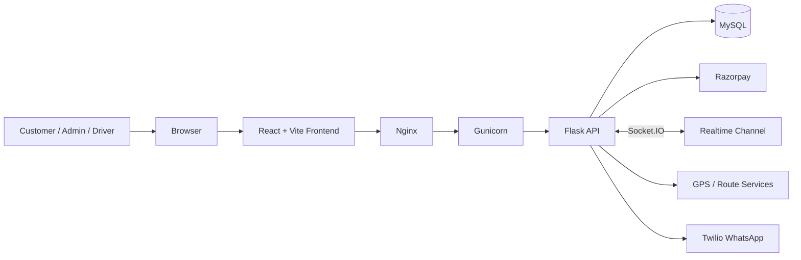

# Architecture

## System Overview

SKDLS Transport AI uses a modern split architecture:

- React/Vite renders the premium logistics UI in the browser
- Nginx serves the frontend build and proxies API traffic
- Gunicorn runs the Flask application on localhost
- Flask handles authentication, bookings, payments, tracking, and admin workflows
- MySQL stores users, shipments, payments, vehicles, and operational history
- Socket.IO delivers real-time tracking and activity updates

## High-Level Diagram

## Request Flow

1. The user interacts with the React frontend.
2. The frontend sends API requests to `/api/*` through Nginx.
3. Nginx forwards the request to Gunicorn on `127.0.0.1:8000`.
4. Flask validates JWT cookies and route permissions.
5. Flask reads or writes data in MySQL.
6. For live operations, Socket.IO pushes updates back to the client.
7. Payment creation and verification use Razorpay-backed endpoints.

## Core Runtime Layers

### Frontend

- Vite build output is served from `frontend/dist`
- React route guards keep admin and authenticated flows separate
- Shared UI primitives handle toasts, onboarding, offline banners, and skeletons

### Backend

- Flask exposes shipment, tracking, payment, auth, and admin APIs
- JWT authentication protects private routes
- Flask-SocketIO supports live operational updates
- Flask-Limiter and request validation protect public endpoints

### Data Layer

- MySQL stores canonical business records
- Shipment history and payment state are persisted server-side
- Demo data can be enabled in the frontend without changing backend behavior

### Infrastructure

- Nginx acts as public entrypoint and reverse proxy
- Gunicorn runs the app process behind Nginx
- PM2 supervises Gunicorn on EC2
- AWS EC2 hosts both the frontend build and backend runtime

## Key Domains

- Booking: shipment creation, pricing, and timeline updates
- Tracking: GPS routes, vehicle markers, and live status
- Payments: Razorpay order creation and verification
- Admin: shipment oversight, driver management, and analytics
- Chat: AI-assisted logistics support and workflow guidance

## Operational Notes

- Public traffic should only hit Nginx
- Gunicorn should remain bound to localhost
- Frontend API base URL should point to `/api`
- WebSocket and HTTP traffic should share the same domain in production
